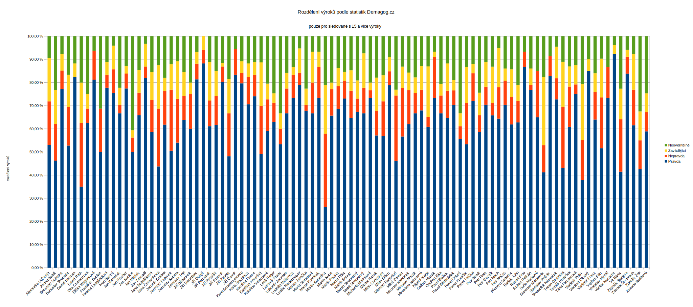

# Počítadlo lží politiků
Skript pro stáhnutí dat z demagog.cz a výpočtu "lživosti" jednotlivých politiků.

Princip je jednoduchý: stáhnout se data ze serveru demagog.cz a pro každý stažený subjekt se vypočítá míra lhaní podle následujícího vzorce:

míra\_lhaní = počet\_nepravd / (počet\_všech\_výroků)

kde počet\_všech\_výroků znamená součet počtu pravda, nepravd, zavádějících a neověřitelných. Pokud někdo nemá na kontě žádný výrok, je míra\_lhaní rovna 0.

**Je mi jasné, že výsledky mohou být nevypovídající, např. protože někteří mají uveden jen jeden výrok a to nepravdivý. Nicméně pro hrubou představu u známějších a do debat častěji zvaných politiků to postačit může.**

## Parametry programu
Skript má parametry, kterými lze nastavovat výstup. Implicitní chování je výpis všech jmen s jejich hodnotami jméno;pravda;nepravda;zavádějící;neověřitelné;míra\_lhaní.
* --most-lying -- seznam politiků seřazených podle míry nepravdivých výroků
* --most-truth -- seznam politiků seřazených podle míry pravdivých výroků
* --most-misleading -- seznam politiků seřazených podle míry zavádějicích výroků
* --most-nonverifiable -- seznam politiků seřazených podle míry neověřitelných výroků

Řazení je sestupné, tedy největší hodnoty jsou nahoře. K vzestupnému řazení slouží parametr -a

Protože míry pravdivosti jsou přesnější, čím více výroků dotyčný má, a některé výsledky mohou být zavádějící (má-li dotyčný jen 1 výrok a ten je lživý, je jeho míra lhaní 100%), je tu k dispozici parametr --min-statement-count <hodnota>, kterým se dá nastavit požadovaný minimální počet výroků; pokud je výroků méně, není taková osoba přidána do výpisu.

## Přiložené soubory

V adresáři stats/ je několik vygenerovaných souborů.

V souboru demagog-lhari.csv je vygenerovaný soubor, jména jsou seřazena od největší míry lhaní po nejnižší. Jde o statistiku pro sledované s 15 a více výroky.

Soubor demagog-pravdomluvni.csv obsahuje seznam seřazený podle toho, kdo mluvil nejvíce pravdu (vzniklo jednoduchou modifikací skriptu). Opět pro ty s 15 a více výroky.

Soubor stats-\*.csv bude obsahovat statistiku všech výroků k danému dni v následujícím formátu: jméno;pravda;nepravda;zavádějící;neověřitelné;míra\_lhaní

Doporučuji u souborů kontrolovat čas vytvoření, nejsou to aktuální data!
